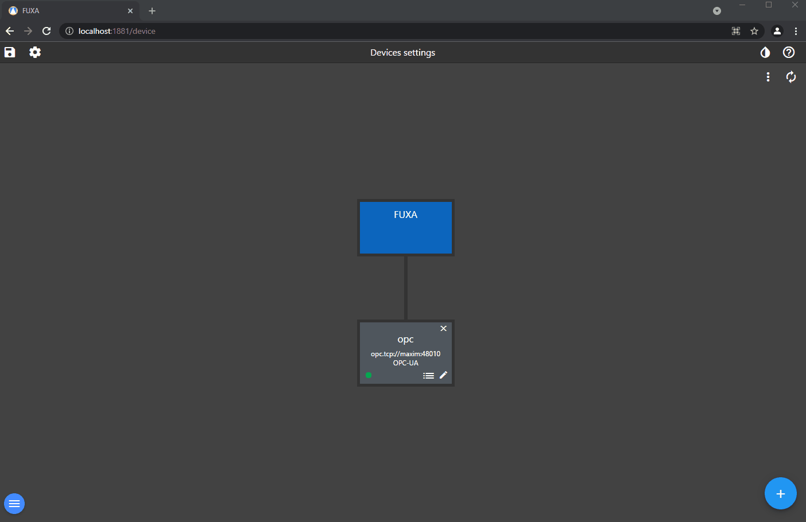

To add your Device and Tags going to **Connections** in editor.

Add and connect a **OPCUA** device.

To add OPCUA Tags the device have to be connected.

To add a **Modbus** connection you have to install the driver in **Plugins**

Add a **MQTT** connection and a topic subscription

Add a **WebAPI** connection and a Tag of the JSON result

**Tag Options**

If you have any Tag types which don't have a defined data type you can set this. For example TIME data type is no a defined type, but the base data type is normally int64 or uint64 and the time is in milliseconds.

You can also under tag options use the scale script to do any data type conversions etc for example the data from TIME is an array of LOW and HIGH, we can create a simple script to grab the array element and return it as a number type. We can then just return the actual value for write if needed.

**Important!** the script parameter must be called value as there is a filter to display relevant scripts for selection. Do not use comments in this script as they are not supported. 

Here is the read script which returns the array element

Here is the write script returning the actual tag value

 