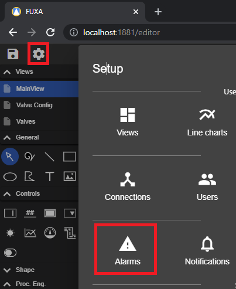
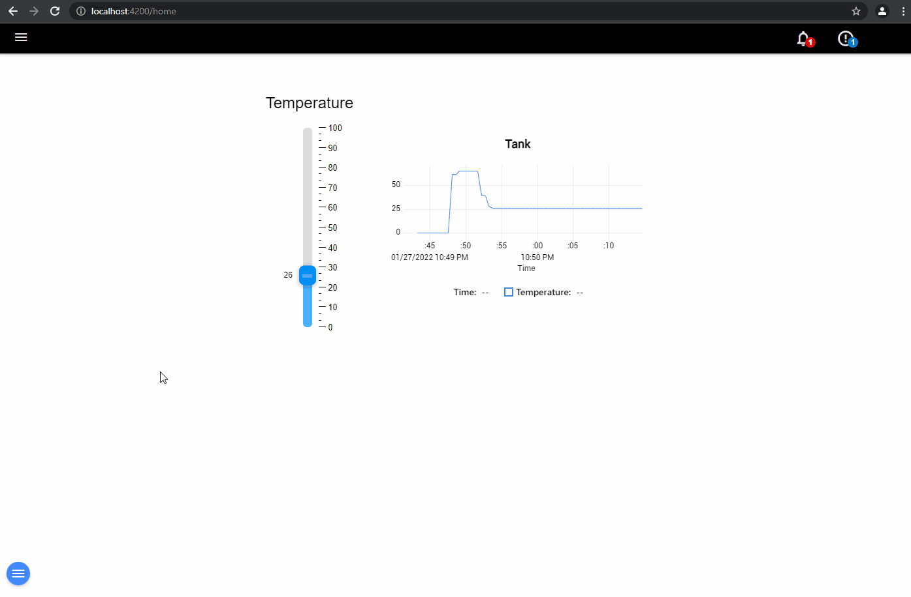
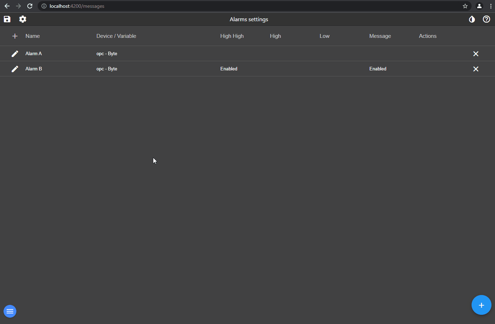

To configure alarms going to **Alarms** in editor.

An alarm ist bind to one Tag to whitch can you define 4 types of conditions for respective levels (High High, High, Low and Message).

The active alarms and the history can be displayed by configuring the view from the menu or the button on the header. [**Layout settings**](https://github.com/frangoteam/FUXA/wiki/HowTo-View-Layout).

It is also possible to configure several actions per alarm like show popup dialog or set a value to a tag.

