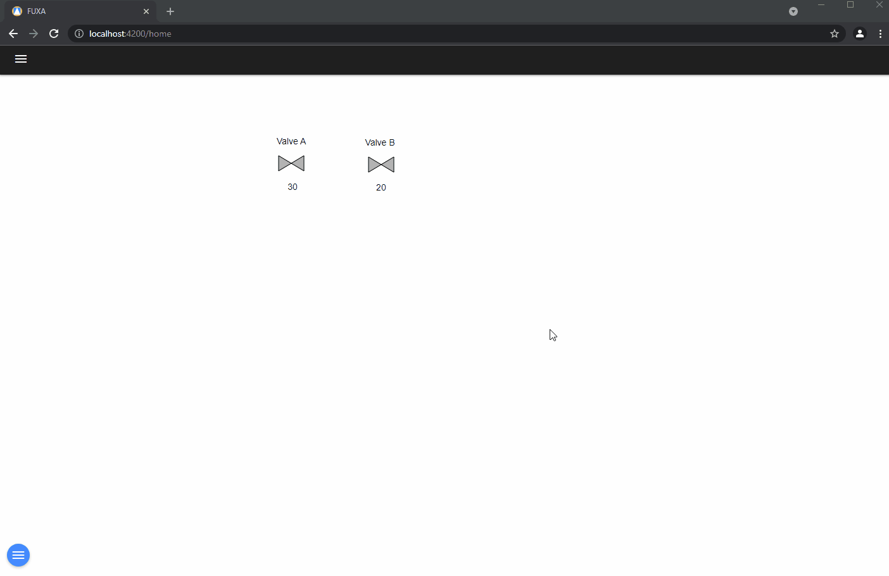
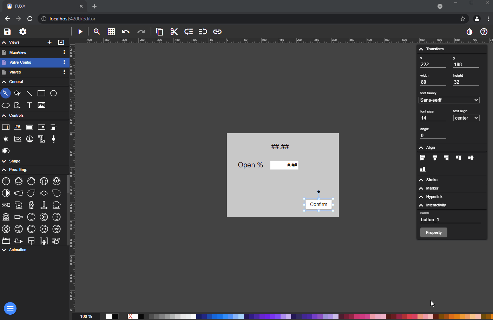
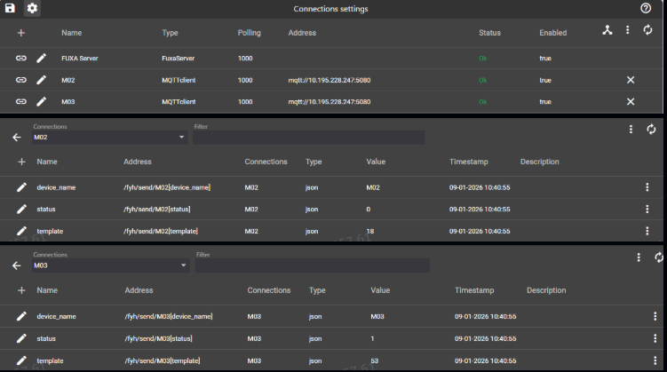
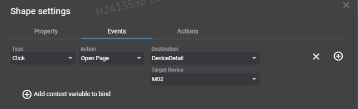
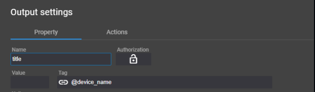
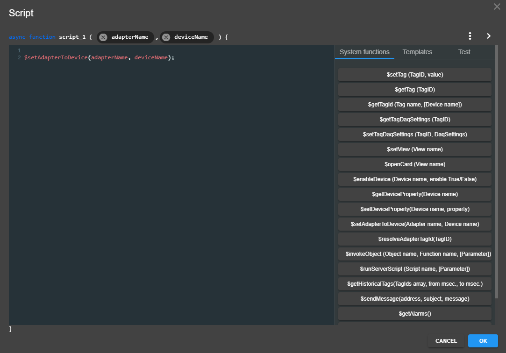

You can reuse the same **View** for repeating components like pumps and valves.

You have to define a device as **internal** and some variable (Tag) and bind it to the controls of reusable **View**.
For example the title dialog and a variable for the input value.

Then define in every component the **Events** to open the dialog, where you map the internal tags to the device tags.

If you wish, you can also add a confirmation button.

## Extended Method: Shared detail page with Target Device

The core purpose of this feature is to dynamically display detailed data of multiple devices of the same type through one shared page template, avoiding separate detail pages for each device.

### Implementation Steps

1. Establish device connections and tags
Create two (or more) device connections of the same type in **Connections**.
Use exactly the same tag names under each device to keep data structure and references consistent.

2. Create view pages
Create two views:
- **Device List Page**: displays all devices and contains the "View Details" buttons.
- **Device Detail Page**: a reusable template for detailed device data.

3. Configure navigation logic in list page buttons
On each "View Details" button:
- **Target Page**: set the shared Device Detail Page.
- **Target Device**: set the specific device for that button.

4. Bind tags in the detail page template
In the detail page, bind variables using `@[tag_name]` (example: `@[device_name]`).
When opened from the list page with Target Device, placeholders are resolved against the selected device tags.

- Chart configuration supports placeholders, so charts can be reused with the same dynamic device-binding approach.

Summary:
One template page can show details for multiple devices. Clicking different device buttons opens the same detail page with the corresponding real-time data.

Reference and images:
- Discussion #2118: https://github.com/frangoteam/FUXA/discussions/2118

### Binding with internal adapter proxy
Internal connection adapter as UI proxy
You can define internal connection adapters and create tags bound to UI components independently of a specific device.
Via client-side scripts, assign which real device the internal adapter should reference at runtime.
Reads/writes are redirected to the selected device when tag names match.

Reference and images:
- Pull Request #1810: https://github.com/frangoteam/FUXA/pull/1810

