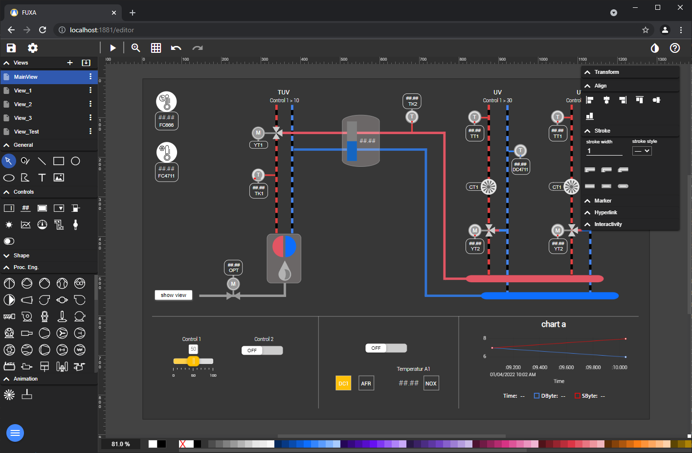
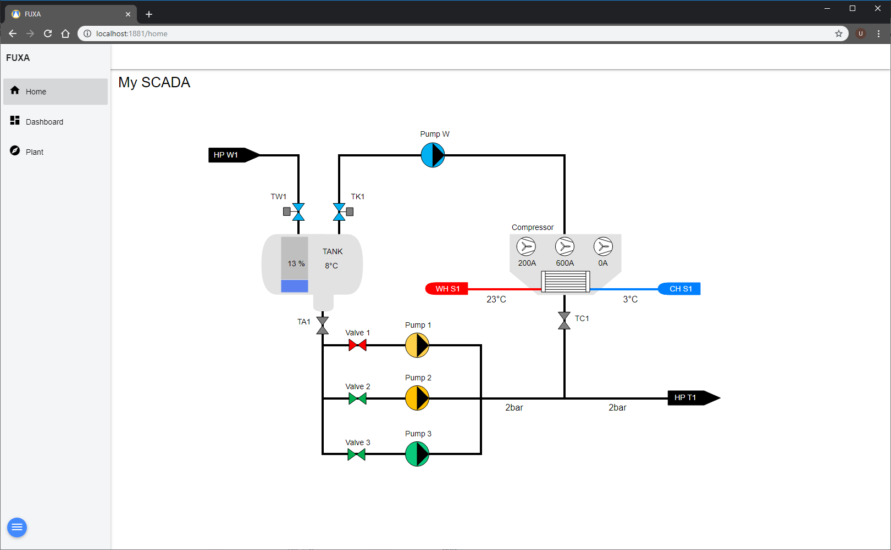

## Welcome to the FUXA wiki!

FUXA is a powerful **web-based** software to rapidly build and deploy scalable SCADA, HMI, Dashboard or IIoT systems. With FUXA you can create modern process visualizations with individual designs for your machines and real-time data display, as well as control instrument of automated industrial plants.

FUXA supports commonly used communication standards such as Siemens S7 protocol and OPC UA that allow to connect third-party OPC servers. The list of supported  communication standards can be extended by developing additional drivers.

The software model of FUXA is based on a Node.js runtime that you point a web browser at to access the editor to create your app (SCADA/HMI/Dashboard) and as client you can run your visualizations.

## User Interface

FUXA is composed from two differents views: FUXA-editor to edit the project and FUXA-view to show the product of your visualization project.

## Features

The FUXA not require any runtime licenses. You can build your HMI projects in any number and size and you do not need to worry about further licensing the runtime environment.

### Communication Protocols
The FUXA Platform includes connectors to achieve direct communications to Siemens PLCs and OPC UA data sources:
- A client for OPC UA connectivity.
- S7 Protocol to communicate over Ethernet with Siemens CPU 200, 300, 400, 1200, and 1500.
- Modbus RTU/TCP, BACnet IP, MQTT, Ethernet/IP (Allen Bradley), WebAPI

### Cross-Platform Full-Stack
This system is designed to operate in various operating systems, with easy installation. Backend is develop with NodeJs. The user-interface is a scalable HTML5 web frontend, develop with Web technologies (HTML5, CSS, Javascript, Angular, SVG) and compatible with all recent browsers.