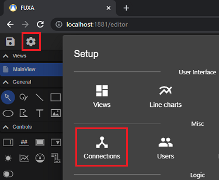
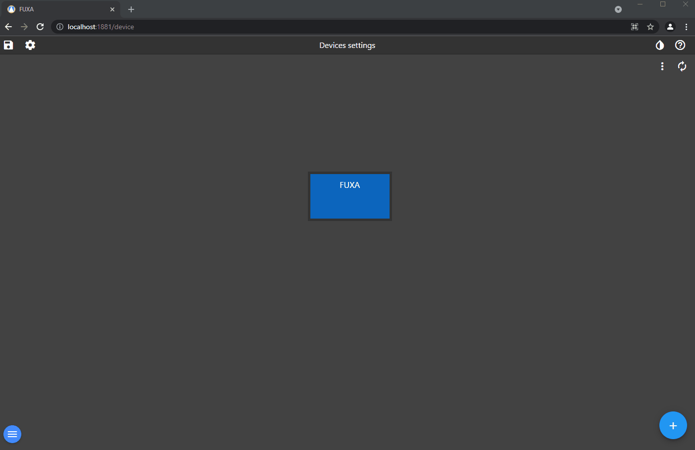
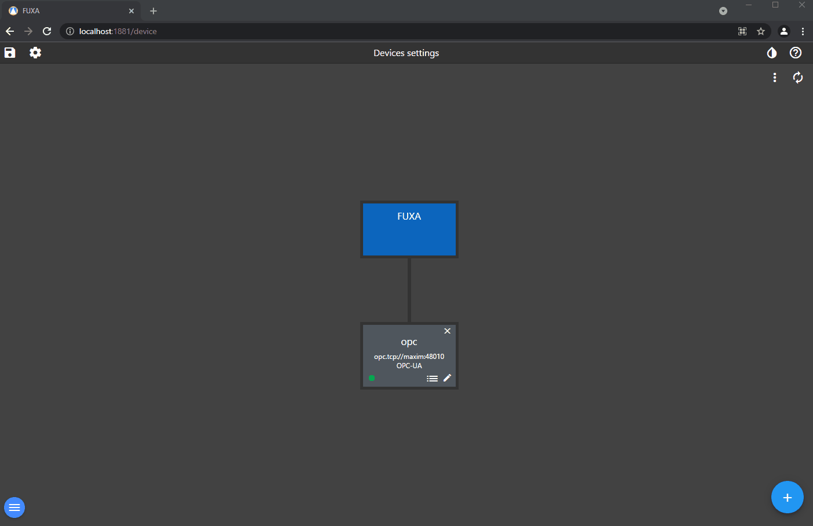
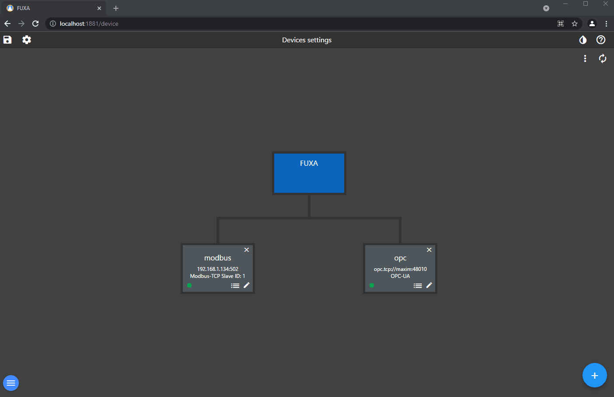
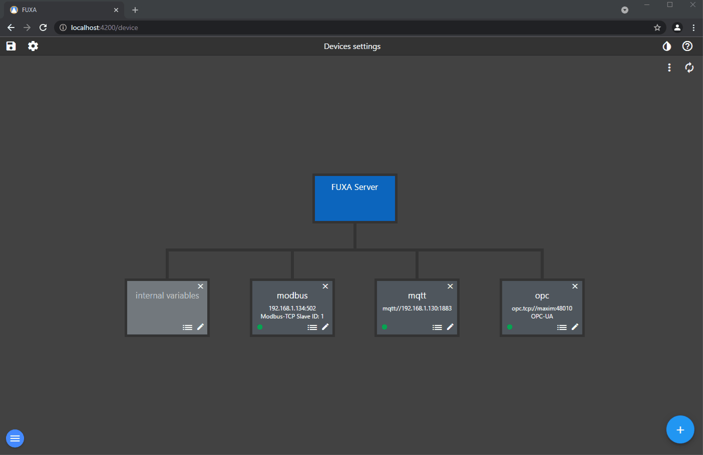

To add your Device and Tags going to **Connections** in editor.

Add and connect a **OPCUA** device.

To add OPCUA Tags the device have to be connected.

To add a **Modbus** connection you have to install the driver in **Plugins**

Add a **MQTT** connection and a topic subscription

Add a **WebAPI** connection and a Tag of the JSON result
