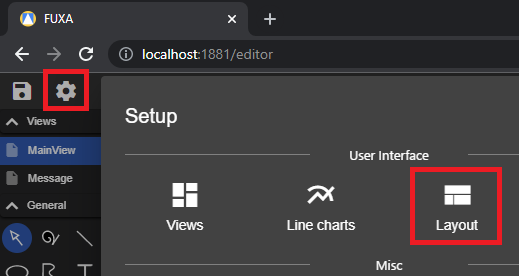
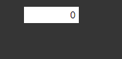
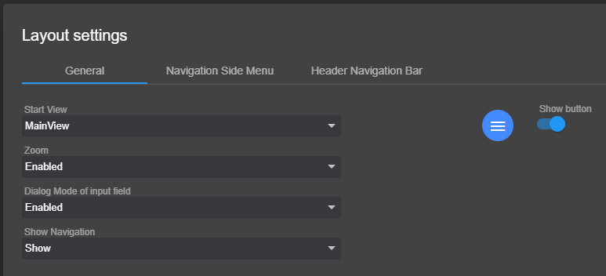
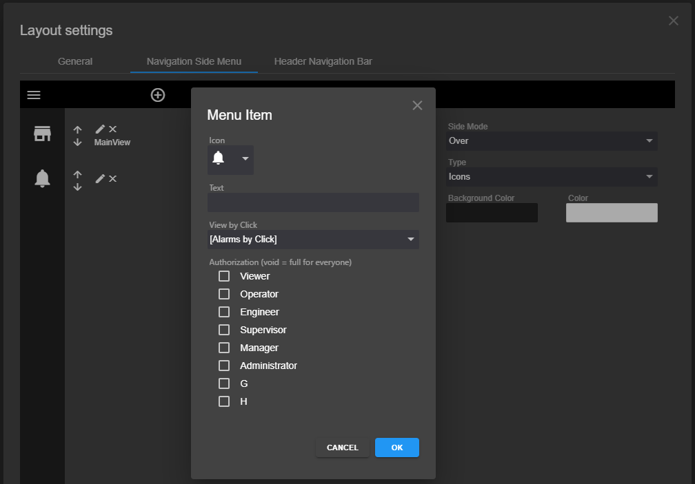
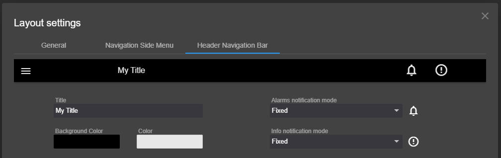

To define the Layout of end user going to **Layout settings** in editor.

In **General** tab you can define:
- **Start View**, the first View (home) show by going to http://localhost:1881.
- **Zoom**, if enabled you can Zoom the View with the Mouse Scroll Wheel and move the View with the Mouse Left Button.
- **Dialog Mode of input field**, if enabled will be show a dialog by Input value control.
    - 

- **Show Navigation**, setting to Show and Hide the Header bar and the navigation Menu
- Hide the development button to switch between Edit and Home.

  

In **Navigation Side Menu** tab you can define the Menu items and diifferent style attributes.

In **Header Navigation Bar** tab you can define if and how to show the Alarms notification items, and diifferent style attributes.

