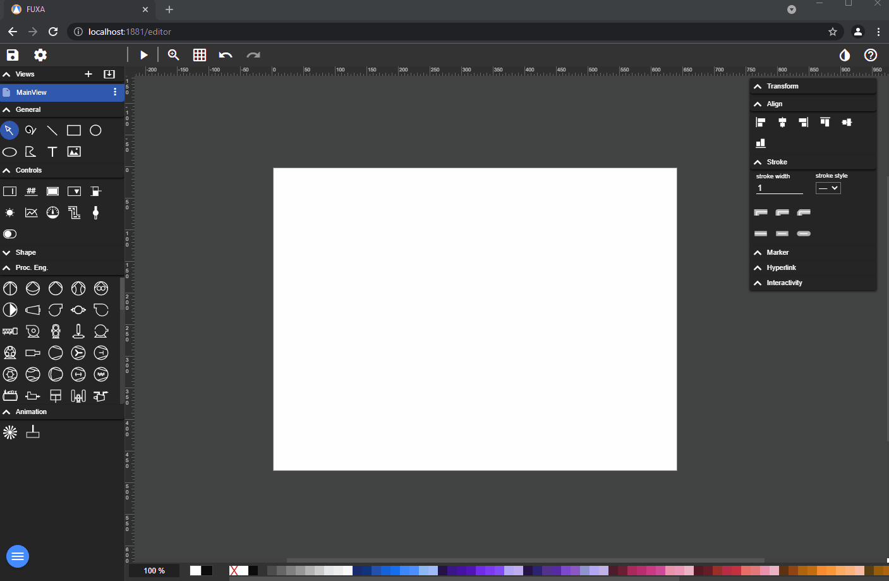
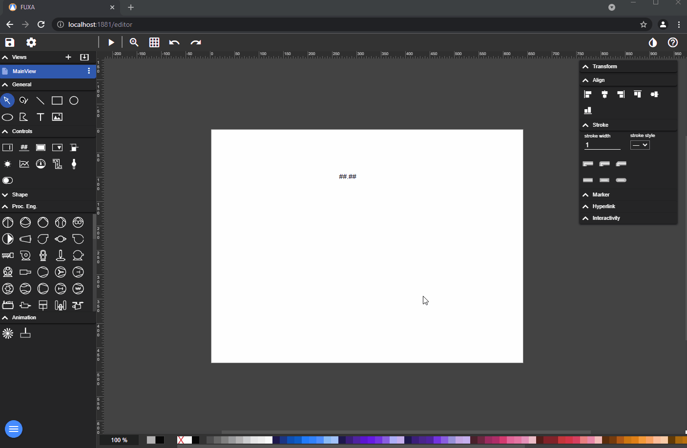
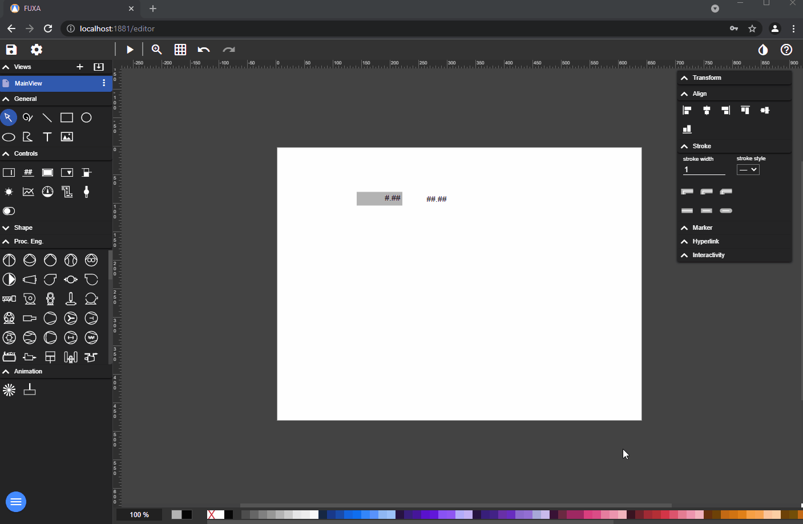
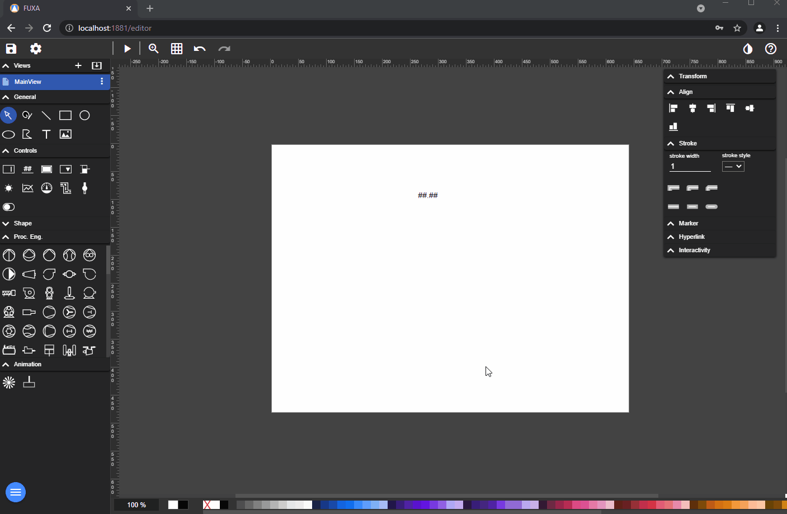

To bind a **Output** Control to the Device Tag (Variable): going in editor and select the View.

To bind a **Input** Control to Device Tag.

To bind a **Select** Control to Device Tag.

To bind a **Slider** Control to Device Tag.
