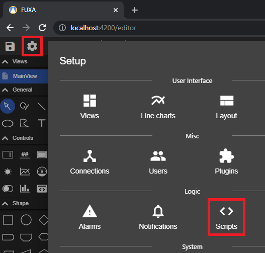
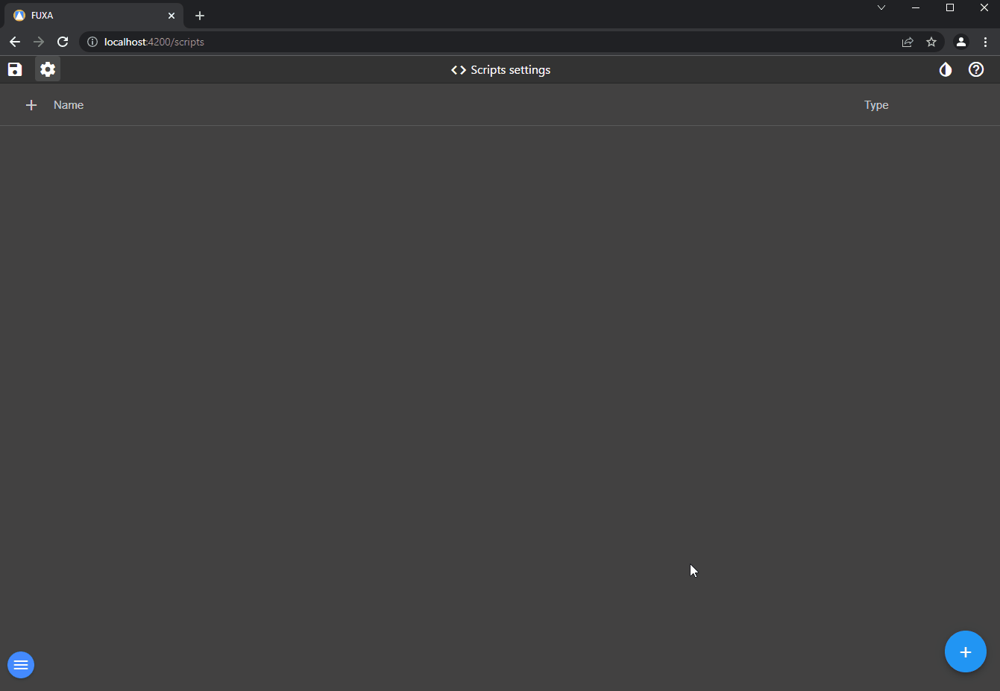
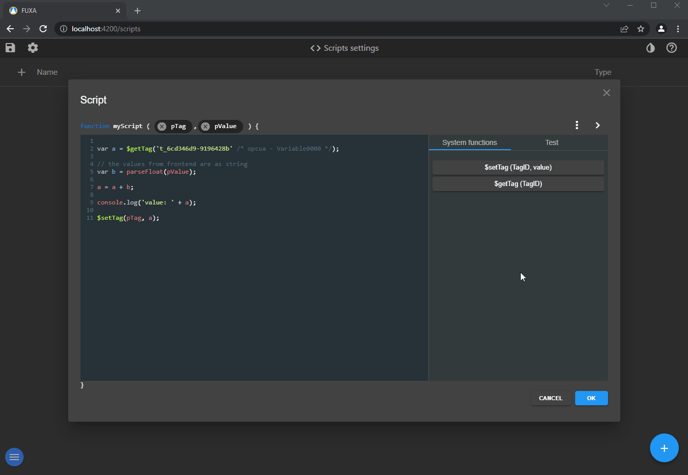
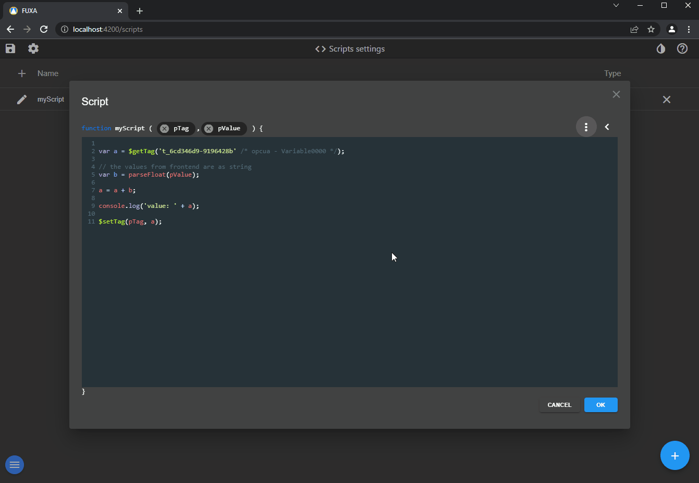

To configure scripts going to **Scripts** in editor.

Add a new script (a script is a javascript function), configure the function name and parameters, there are 2 type of parameters:
 - Tag ID
 - Value, number or string

Then you write your logic into the function. There are system call that you can use:
 - $setTag, to set value of Tag
 - $getTag, to get current Tag value

You can test the script, to verify it makes sense to use the console.log method.

From the GUI you can configure in **Events** the call of script.

