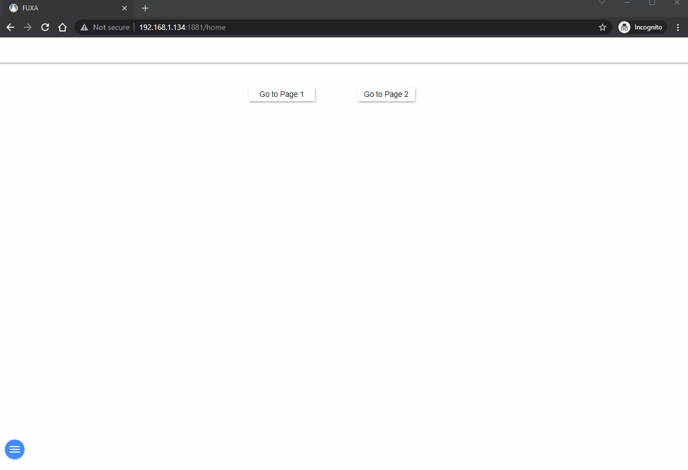
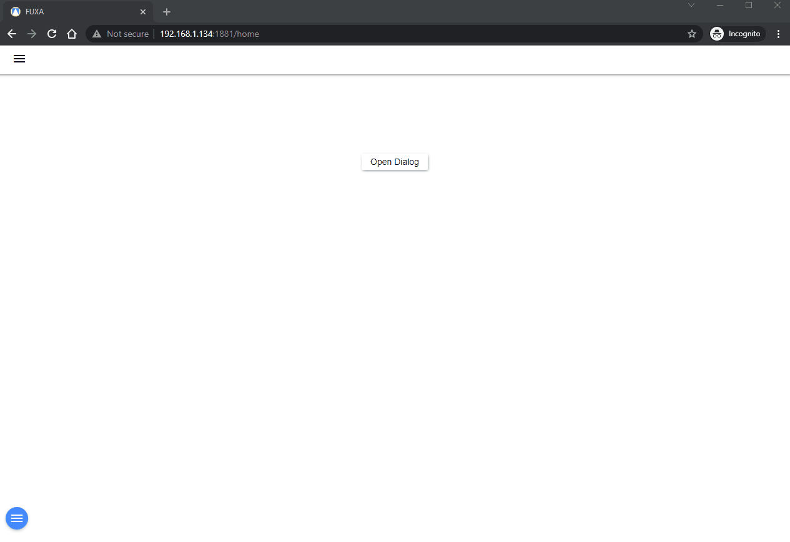
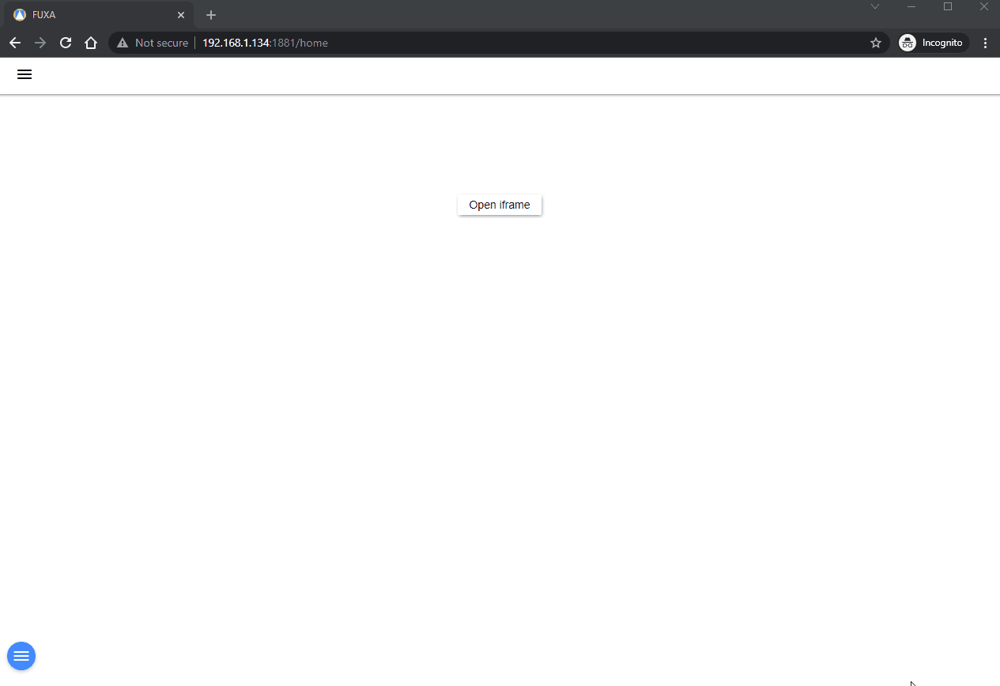
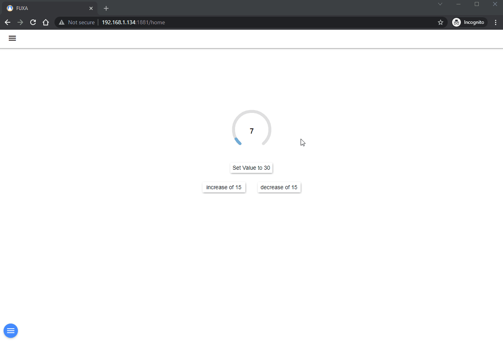
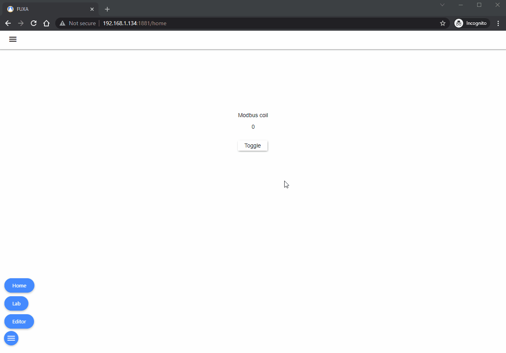

In the Shapes and button control you can configure the mouse **Events** click, mouseDown, mouseUp to execute tasks.

   - [**Open Page**](#open-page)
   - [**Open Card**](#open-card)
   - [**Open Dialog**](#open-dialog)
   - [**Open iframe**](#open-iframe)
   - [**Open Window**](#open-window)
   - [**Set Value**](#set-value)
   - [**Toggle Value**](#toggle-value)
   - [**Set from Input and Close**](#set-from-input-and-close)

## Open Page

Used to display a View in **Main** window.

## Open Card

Used to display a View as Popup window. The **Card** will be displayed next to the mouse at the time of the event, several cards can be displayed at the same time. The same **Card** can be used for example to show values of more pumps.

## Open Dialog

Used to display a View as Dialog, typically to configure values. The **Dialog** will be displayed on top of the screen. The same **Dialog** can be used for example to configure values of more pumps.

## Open iframe

Used to open a window as **iframe** (embedded HTML document from external sources). You can define the window size and the zoom scala.

## Open Window

Used to open a **window** in a new browser. You can define the **window** size.

## Set Value

Used to set Tags value or increase and decrease current value.

## Toggle Value

Used to **toggle** the Tags value 1/0 (if 1 set to 0, if 0 set to 1).

## Set from Input and Close

Combined can be used to set some values through a dialog with a OK confirmation 

