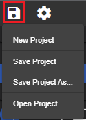

### Create a project
You can create a new project, the current project will be overwritten with the new void project (that have only a void MainView).

### Save the project
The project will be automatically saved in an internal database after every change of settings (dialogs confirmation) like editings 'Device', 'Tag', 'Charts',....
The Views will be automatically saved by selecting another or by leaving the editor.

By **Save Project** you can force the internal saving process.
By **Save Project As…** you can export the whole project to a file in JSON format (MyProject.fuxap), useful for making backups of the project.

### Open the project
You can open a project from the exported file (MyProject.fuxap).
