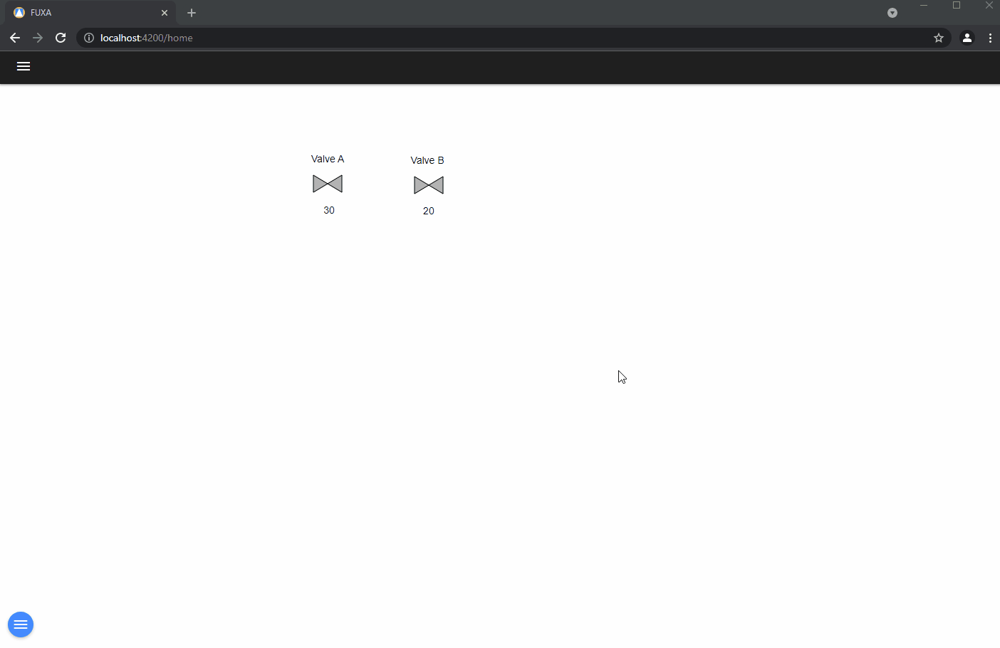
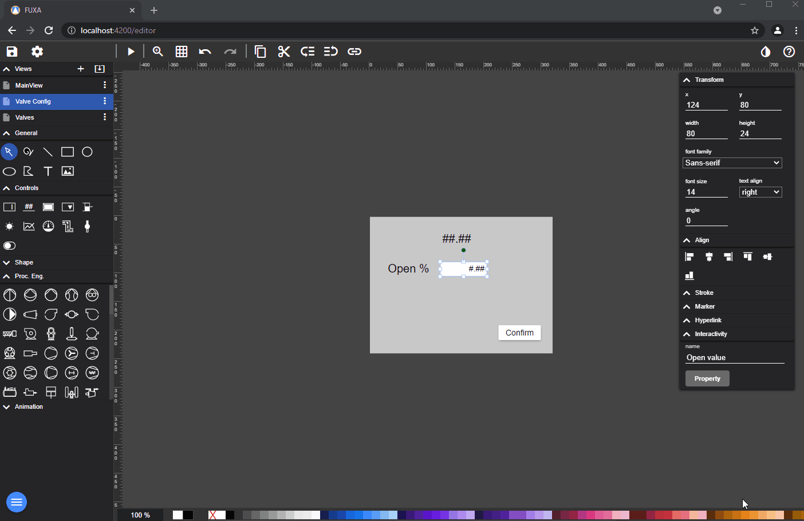
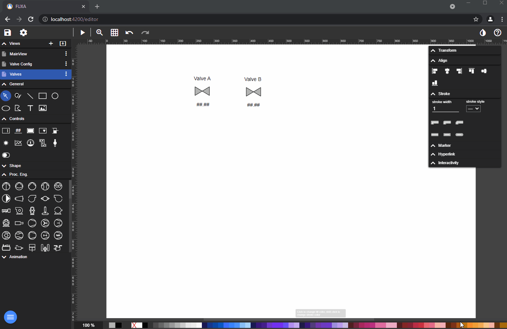
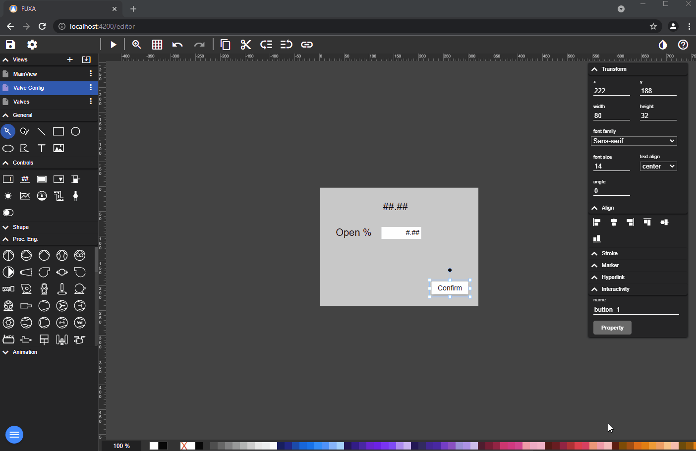

You can reuse the same **View** for repeating components like pumps and valves.

You have to define a device as **internal** and some variable (Tag) and bind it to the controls of reusable **View**.
For example the title dialog and a variable for the input value.

Than you define in every components the **Events** to open the dialog, where you define the connections of the internal tags with those of the device.

If you wish, you can also add a confirmation button.

